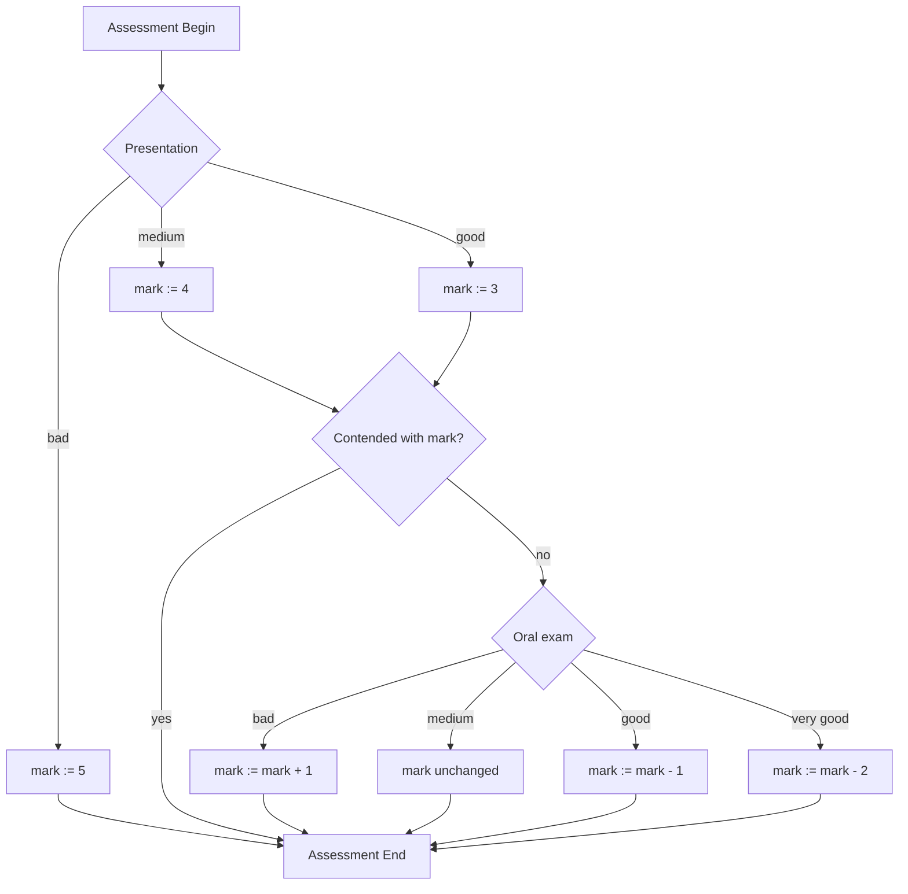

```mermaid
flowchart TD
    A[Assessment Begin] --> B{Presentation}
    B -->|bad| C[mark := 5]
    B -->|medium| D[mark := 4]
    B -->|good| E[mark := 3]
    E --> F{Contended with mark?}
    F -->|yes| Z[Assessment End]
    F -->|no| G{Oral exam}
    G -->|bad| H[mark := mark + 1]
    G -->|medium| I[mark unchanged]
    G -->|good| J[mark := mark - 1]
    G -->|very good| K[mark := mark - 2]
    C --> Z
    D --> F
    H --> Z
    I --> Z
    J --> Z
    K --> Z
```

```mermaid
flowchart TD
    A[Assessment Begin] --> B{Presentation}
    B -->|bad| C[mark := 5]
    B -->|medium| D[mark := 4]
    B -->|good| E[mark := 3]
    E --> F{Contended with mark?}
    F -->|yes| Z[Assessment End]
    F -->|no| G{Oral exam}
    G -->|bad| H[mark := mark + 1]
    G -->|medium| I[mark unchanged]
    G -->|good| J[mark := mark - 1]
    G -->|very good| K[mark := mark - 2]
    C --> Z
    D --> F
    H --> Z
    I --> Z
    J --> Z
    K --> Z
```
