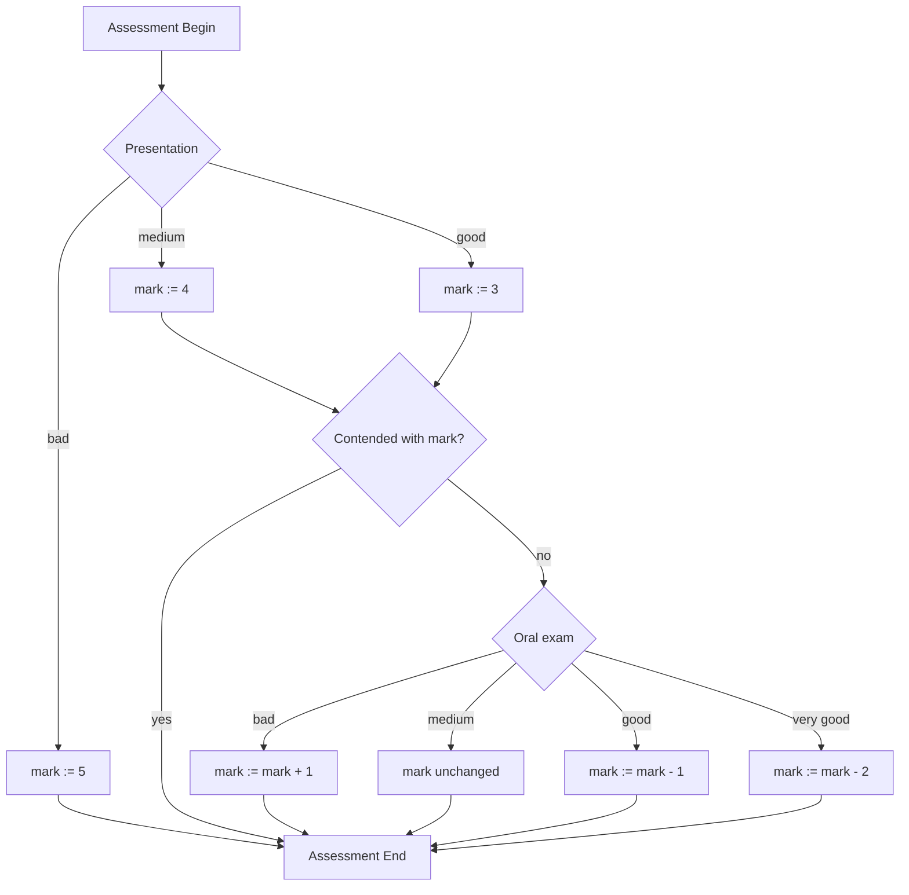
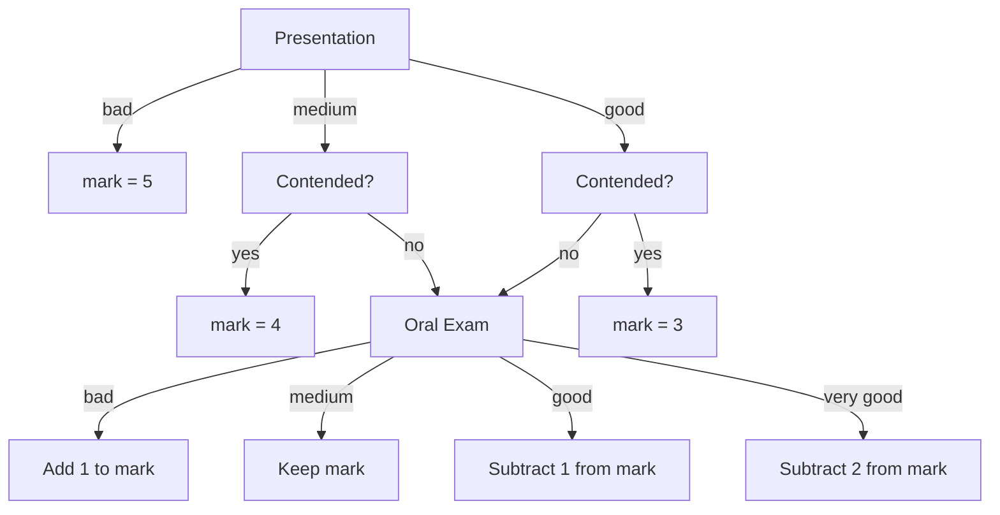
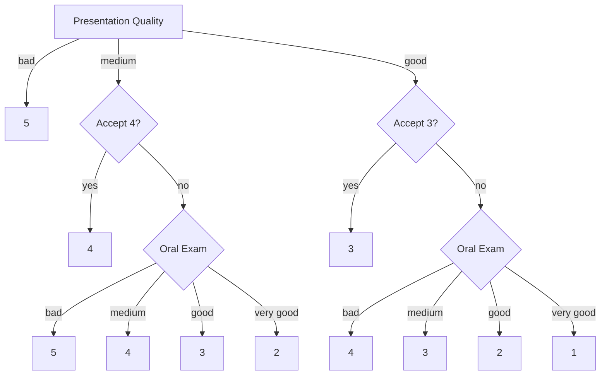

```mermaid
flowchart TD
    A[Assessment Begin] --> B{Presentation}
    B -->|bad| C[mark := 5]
    B -->|medium| D[mark := 4]
    B -->|good| E[mark := 3]
    E --> F{Contended with mark?}
    F -->|yes| Z[Assessment End]
    F -->|no| G{Oral exam}
    G -->|bad| H[mark := mark + 1]
    G -->|medium| I[mark unchanged]
    G -->|good| J[mark := mark - 1]
    G -->|very good| K[mark := mark - 2]
    C --> Z
    D --> F
    H --> Z
    I --> Z
    J --> Z
    K --> Z
```

```mermaid
graph TD
    A[Presentation]
    A -->|bad| B[mark = 5]
    A -->|medium| C[Contended?]
    A -->|good| D[Contended?]
    
    C -->|yes| E[mark = 4]
    C -->|no| F[Oral Exam]
    
    D -->|yes| G[mark = 3]
    D -->|no| F
    
    F -->|bad| H[Add 1 to mark]
    F -->|medium| I[Keep mark]
    F -->|good| J[Subtract 1 from mark]
    F -->|very good| K[Subtract 2 from mark]
```

```mermaid
graph TD
    A[Presentation Quality] -->|bad| B[5]
    A -->|medium| C{Accept 4?}
    A -->|good| D{Accept 3?}
    C -->|yes| E[4]
    C -->|no| F{Oral Exam}
    D -->|yes| G[3]
    D -->|no| H{Oral Exam}
    F -->|bad| I[5]
    F -->|medium| J[4]
    F -->|good| K[3]
    F -->|very good| L[2]
    H -->|bad| M[4]
    H -->|medium| N[3]
    H -->|good| O[2]
    H -->|very good| P[1]
```
